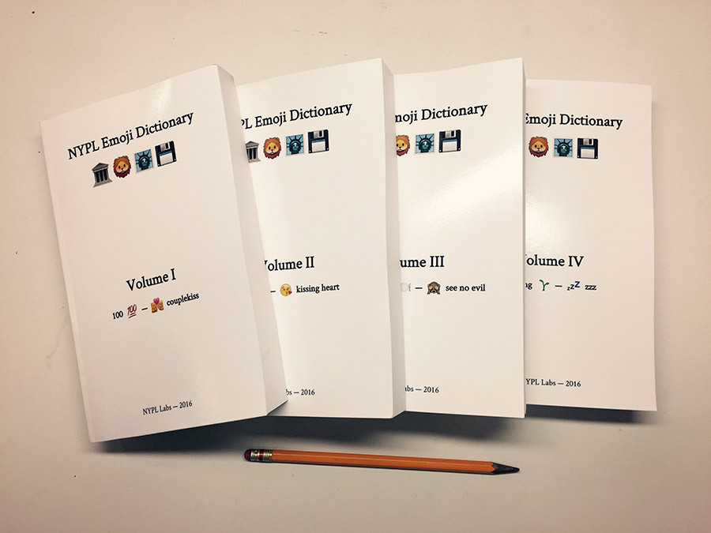

# NYPL Emoji Dictionary

This script creates Emoji Dictionary HTML + PDF from [NYPL Emoji Bot](https://twitter.com/nyplemoji) data.

## NYPL Emoji Bot

NYPL Emoji Bot: https://twitter.com/nyplemoji

✨Send [@NYPLEmoji](https://twitter.com/nyplemoji) an emoji, receive an image ✉️ from [NYPL Digital Collections](http://digitalcollections.nypl.org/).

## Installations

`emoji-dictionary` nees Node.js. To install dependencies, run:

    npm install

## Usage

Running `node index.js` will create HTML covers and volumes in the [`volumes` directory](volumes).

## Photos

## Create PDFs

Open HTML documents, and print to PDF using the correct paper size (on Mac, choose *Print using system dialog*).

## License

### `emoji-dictionary`

Code in this repository: the MIT License (MIT)

### Digital Collections images

The generated HTML and PDF volumes contain images from Digital Collections — see Digital Collections for the image's license.

### JSON Emoji data

[`data/emoji.json`](data/emoji.json): the MIT License (MIT)

From: https://github.com/mroth/emoji-data-js/blob/master/vendor/emoji-data/emoji.json
